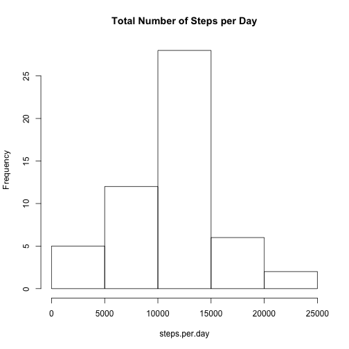
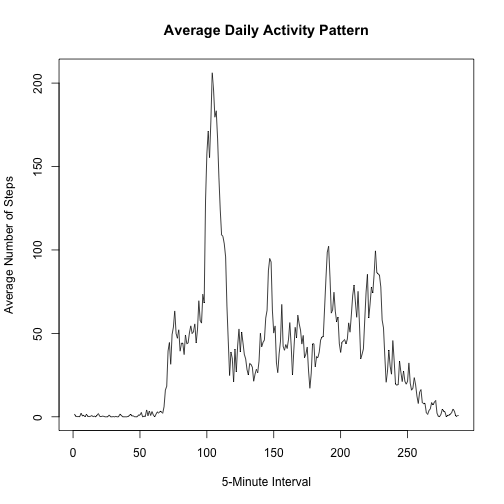
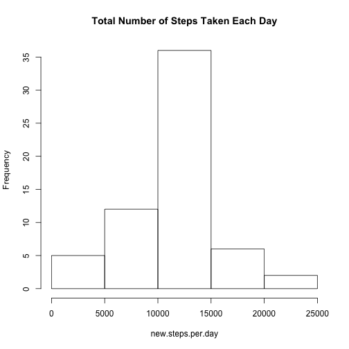
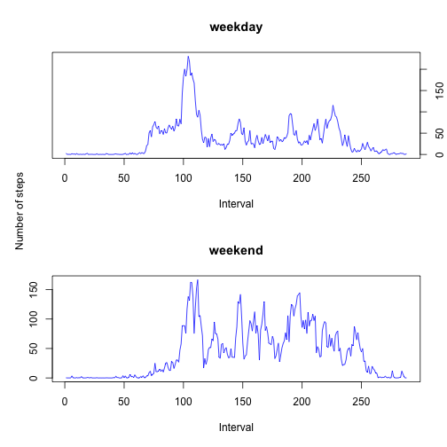

# Reproducible Research: Peer Assessment 1
## Loading and preprocessing the data

```r
unzip("activity.zip")
df <- read.csv("activity.csv")
```

## What is mean total number of steps taken per day?

```r
steps.per.day <- sapply(split(df$steps, df$date), sum)
hist(steps.per.day, main = "Total Number of Steps per Day")
```

 

calculate the mean

```r
mean(steps.per.day, na.rm = TRUE)
```

```
## [1] 10766.19
```

```r
median(steps.per.day, na.rm = TRUE)
```

```
## [1] 10765
```

## What is the average daily activity pattern?

```r
mean.steps.per.interval <- sapply(split(df$steps, df$interval), mean, na.rm = TRUE)
plot(mean.steps.per.interval, 
     type = "l", 
     main = "Average Daily Activity Pattern",
     xlab = "5-Minute Interval", 
     ylab = "Average Number of Steps")
```

 

Which 5-minute interval, on average across all the days in the dataset, contains the maximum number of steps?

```r
max.mean.steps <- max(mean.steps.per.interval, na.rm = TRUE)
names(mean.steps.per.interval[mean.steps.per.interval == max.mean.steps])
```

```
## [1] "835"
```

## Imputing missing values
Total number of missing values in the dataset

```r
sum(is.na(df$steps))
```

```
## [1] 2304
```

Create a new dataset that is equal to the original dataset but with the missing data filled in with the mean for that 5-minute interval.

```r
newdf = df
for (i in 1:nrow(df)){
  if (is.na(newdf$steps[i])){
    newdf$steps[i] <- mean.steps.per.interval[as.character(newdf$interval[i])]
  }
}
```

Make a histogram of the total number of steps taken each day. Calculate and report the mean and median total number of steps taken per day. 
Do these values differ from the estimates from the first part of the assignment? 
What is the impact of inputing missing data on the estimates of the total daily number of steps?

```r
new.steps.per.day <- sapply(split(newdf$steps, df$date), sum)
hist(new.steps.per.day, main = "Total Number of Steps Taken Each Day")
```

 

calculate the mean

```r
mean(new.steps.per.day)
```

```
## [1] 10766.19
```

```r
median(new.steps.per.day)
```

```
## [1] 10766.19
```

## Are there differences in activity patterns between weekdays and weekends?
Create a new factor variable in the dataset with two levels – “weekday” and “weekend” indicating whether a given date is a weekday or weekend day.

```r
newdf$daytype <- weekdays(as.Date(newdf$date))
for(i in 1:nrow(newdf)){
  if (newdf$daytype[i] == "Saturday" | newdf$daytype[i] == "Sunday"){
    newdf$daytype[i] = "weekend"
  }else{
    newdf$daytype[i] = "weekday"
  }
}
newdf$daytype = factor(newdf$daytype)
```

Make a panel plot containing a time series plot (i.e. type = "l") of the 5-minute interval (x-axis) and the average number of steps taken, averaged across all weekday days or weekend days (y-axis). 

```r
df.weekday <- newdf[newdf$daytype == "weekday",]
df.weekend <- newdf[newdf$daytype == "weekend",]
mean.df.weekday <- sapply(split(df.weekday$steps, df.weekday$interval), mean)
mean.df.weekend <- sapply(split(df.weekend$steps, df.weekend$interval), mean)

par(mfrow = c(2,1))
plot(mean.df.weekday, type = "l", col = "blue", main = "weekday", xlab = "Interval", ylab = "", yaxt = "n")
axis(side = 4)
plot(mean.df.weekend, type = "l", col = "blue", main = "weekend", xlab = "Interval", ylab = "")
par(mfrow = c(1, 1), mar = c(4, 2, 2, 2))
mtext("Number of steps", side = 2)
```

 
